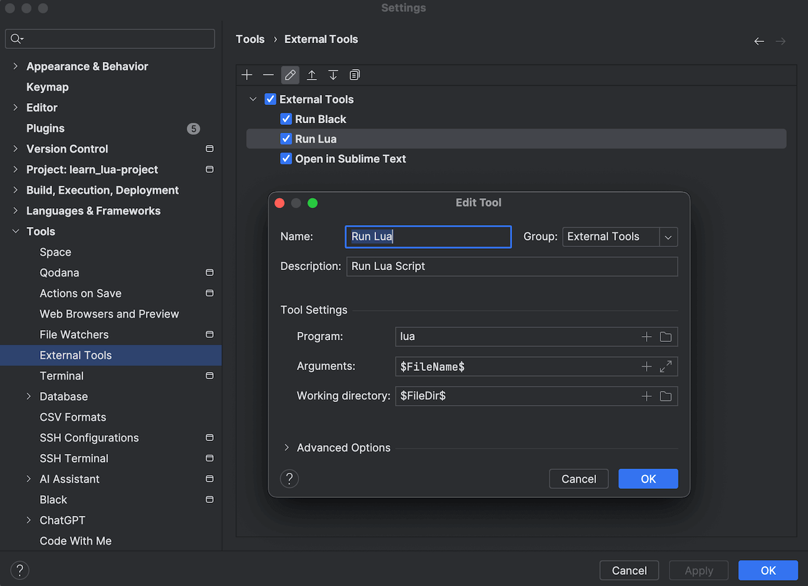

.. _lua-local-development-environment:

Lua Local Development Environment
==============================================================================
有了一个比较趁手的本地开发环境和工具链, 学习和使用任何编程语言都能事半功倍. 本文就来介绍一下我的本地 Lua 开发环境.

Install Lua
------------------------------------------------------------------------------
Lua 的源码是 C 写的. Lua 解释器 (可执行文件) 在不同的平台 (操作系统, 嵌入式) 需要编译后才能使用. 当然官方已经有不同的平台下的预编译版本了. 在 `Luabinaries <http://luabinaries.sourceforge.net/download.html>`_ 这里可以找到 Window 和 Linux 平台下的下载. 当然在 Linux 下你可以直接用 ``yum / apt / ... install lua`` 来进行安装. 而在 MacOS 下你可以用 Homebrew 上的 `lua formula <https://formulae.brew.sh/formula/lua>`_, 用 ``brew install lua`` 命令进行安装.

Install Lua on MacOS
------------------------------------------------------------------------------
1. 安装 Homebrew: https://brew.sh/
2. 用 Homebrew 安装 Lua: ``brew install lua``
3. 用 ``which lua`` 找到 lua 的解释器的位置, 然后试一试 ``lua -v`` 命令看看是否安装成功了
4. 创建一个 ``hello.lua`` 纯文本文件, 然后复制粘贴以下脚本, 然后用 ``lua hello.lua`` 命令试试运行, 看看会不会打印 ``Hello World!``.

.. literalinclude:: ./hello.lua
   :language: lua
   :linenos:

Lua IDE
------------------------------------------------------------------------------
我个人不是 Lua 专家, 我不知道专业的 Lua 开发圈子里最流行的工具是什么. 我只能说说我习惯的 IDE.

由于我是重度 Python 开发者, 目前我是用 JetBrain 家的 PyCharm 作为代码编辑器, 以及用 EmmyLua 插件 (https://plugins.jetbrains.com/plugin/9768-emmylua) 提供语法高亮, 静态分析, 引用跳转, 代码重构功能. 调试脚本用 Terminal 中的 ``lua ${filename}``. 或是 PyCharm 中的 External Tool 功能.

下图是用 PyCharm External Tool + 快捷键来运行当前 Lua 脚本的配置截图.

我个人的快捷键是按 ``CTRL + CMD + L`` 来运行当前 Lua 脚本.

Package Manager in Lua
------------------------------------------------------------------------------
Lua 也是有包管理概念的. 官方工具是 `luarocks <https://luarocks.org/>`_. 这里先不展开说.